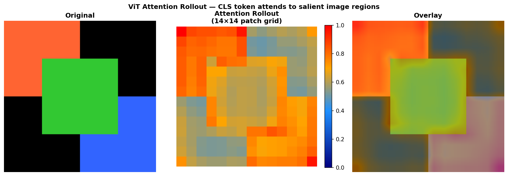
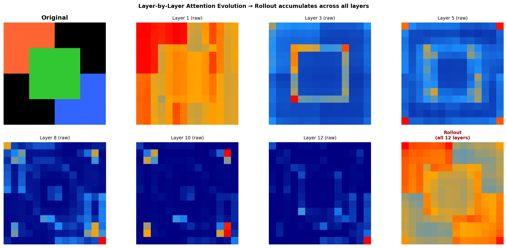

# Vision Transformer (ViT) Attention Rollout Visualizer

This project implements the Attention Rollout algorithm from scratch to visualize the internal information flow and decision-making process of a Vision Transformer (ViT). It is based on the ACL 2020 paper, ["Quantifying Attention Flow in Transformers"](https://arxiv.org/abs/2005.00928) by Abnar & Zuidema.

## Features

* **Layer-by-Layer Attention Evolution**: Understand how the model's focus shifts as information propagates deeper into the network.
* **Head Diversity Analysis**: Visualize how different self-attention heads specialize in different spatial regions of the image.
* **Noise Reduction**: Custom thresholding (discard ratio) to filter out low-attention noise and sharpen the saliency map.
* **Patch-Level Saliency**: High-resolution heatmaps pinpointing the exact image patches the `[CLS]` token attends to.

## Quick Demo

The images below demonstrate how the `[CLS]` token aggregates attention across all 12 layers of a ViT-B/16 model to highlight the salient subjects (e.g., the dog).


*(Left: Original Image, Center: 14x14 Attention Rollout Grid, Right: Heatmap Overlay)*


*(Observe how early layers capture low-level patterns, while deeper layers aggregate them into object-level concepts, culminating in the final rollout).*

## How it Works

Standard attention visualizations often only look at the last layer of a Transformer. However, since layer $l$ attends to the outputs of layer $l-1$, the final layer's raw attention doesn't capture the full spatial context.

Attention Rollout computes the true attention distribution by recursively multiplying the attention matrices across all layers, accounting for the skip connections (residual paths):

$$\hat{A}_l = 0.5 \bar{A}_l + 0.5 I$$
$$Rollout = \hat{A}_L \times \hat{A}_{L-1} \times \dots \times \hat{A}_1$$

Where $\bar{A}_l$ is the head-averaged attention matrix for layer $l$, and $I$ is the identity matrix representing the skip connection.

## Setup & Usage

### Prerequisites
* Python 3.8+
* PyTorch
* Torchvision
* Matplotlib
* Pillow

```bash
pip install torch torchvision matplotlib pillow requests numpy
```

### Running the Visualizer
Simply execute the main script. It will automatically download a sample image, load a pre-trained `vit_b_16` from `torchvision`, apply custom PyTorch forward hooks (`register_forward_hook`) to extract the attention weights, and generate all visualizations in the `plots/` directory.

```bash
python run.py
```
