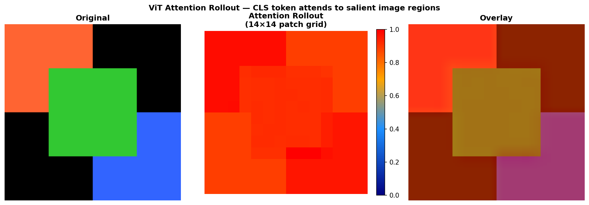
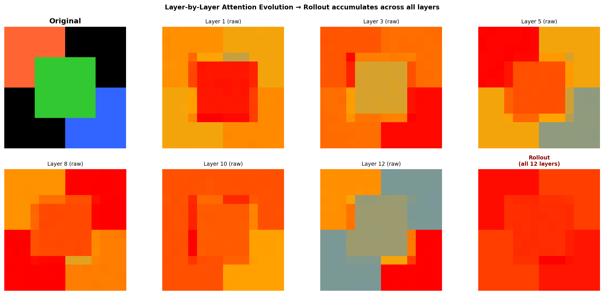
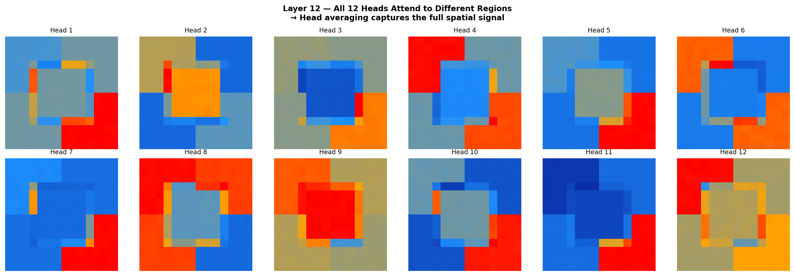

# Vision Transformer (ViT) Attention Rollout Visualizer

This repository contains a from-scratch implementation of the **Attention Rollout** algorithm, designed to visualize and quantify the internal information flow within Vision Transformers (ViTs). It provides deep insights into how ViTs process spatial information and make decisions, acting as a powerful Explainable AI (XAI) tool.

The implementation is based on the ACL 2020 paper: ["Quantifying Attention Flow in Transformers"](https://arxiv.org/abs/2005.00928) by Samira Abnar and Willem Zuidema.

---

## The Problem: Why "Attention Rollout"?

When trying to interpret what a Vision Transformer is "looking at," the naive approach is to simply visualize the self-attention weights of the final layer (specifically, how the `[CLS]` token attends to the input patches). 

However, this is fundamentally flawed. In a deep Transformer:
* **Layer $L$** attends to the output of **Layer $L-1$**.
* **Layer $L-1$** attended to the output of **Layer $L-2$**, and so on.

The raw attention of the final layer only tells us how the final representation is constructed from the *penultimate* representations, not from the *original image patches*. To get the true saliency map, we must trace the attention paths backward through all the layers. **Attention Rollout** solves this by recursively accumulating attention across every layer in the network.

---

## Core Features & Visual Analysis

This project doesn't just compute the rollout; it generates a comprehensive suite of visual analytics to understand the ViT's inner workings.

### 1. The Rollout Overlay (The Final Saliency Map)
By computing the rollout, we map the final `[CLS]` token's attention directly back to the original $14 \times 14$ image patch grid. This highlights the exact regions of the image that drove the model's final representation.


*(Left: Original Image | Center: 14x14 Attention Rollout Grid | Right: Heatmap Overlay)*

### 2. Layer-by-Layer Attention Evolution
How does the model build its understanding? This visualization tracks the `[CLS]` token's attention from Layer 1 to Layer 12. 
* **Early layers** act like edge/texture detectors, with highly diffuse and scattered attention.
* **Deeper layers** become highly semantic, aggregating information into object-level concepts.



### 3. Multi-Head Diversity Analysis
Transformers use Multi-Head Self-Attention (MHSA). This module breaks down the final layer to show what each of the 12 independent attention heads is focusing on. You can clearly see that different heads specialize in different features (e.g., one head looks at the face, another tracks the outline).



### 4. Noise Reduction via Attention Thresholding (Discard Ratio)
To remove background noise from the heatmaps, the algorithm supports a `discard_ratio`. By zeroing out the lowest $N\%$ of attention weights before rolling out, we force the visualization to focus only on the most critical pathways, resulting in sharper, more accurate object segmentation.

---

## Mathematical Implementation

The core algorithm is implemented in `attention_rollout.py`. It computes the true attention distribution by recursively multiplying the attention matrices across all layers, crucially accounting for the residual (skip) connections.

1. **Head Fusion**: For a given layer $l$, we average the attention weights across all heads to get a single attention matrix $\bar{A}_l$:
   $$\bar{A}_l = \frac{1}{H} \sum_{h=1}^{H} A_{l}^{h}$$

2. **Modeling Skip Connections**: To account for the residual connections that bypass the attention mechanism, we add an identity matrix $I$ to the fused attention:
   $$\hat{A}_l = 0.5 \bar{A}_l + 0.5 I$$

3. **Recursive Rollout**: We matrix-multiply the adjusted attention matrices from the final layer $L$ down to the first layer $1$:
   $$Rollout = \hat{A}_L \times \hat{A}_{L-1} \times \dots \times \hat{A}_1$$

The resulting $Rollout$ matrix has dimensions $(N+1) \times (N+1)$ where $N$ is the number of image patches. The row corresponding to the `[CLS]` token (index 0) contains the final saliency scores for all patches.

---

## Technical Details & PyTorch Architecture

Instead of modifying the source code of the `torchvision` ViT model, this project uses **PyTorch Forward Hooks** (`register_forward_hook`). 

A custom wrapper (`ViTAttentionExtractor`) dynamically intercepts the forward pass at every Transformer block, captures the raw `(Batch, Heads, Sequence, Sequence)` attention tensors, and stores them. This approach is highly modular and allows the rollout algorithm to be plugged into *any* HuggingFace or Torchvision model without architectural rewrites.

---

## Setup & Usage

### Prerequisites
* Python 3.8+
* `torch` and `torchvision` (for the ViT model and tensor operations)
* `matplotlib` and `Pillow` (for heatmap generation and image processing)

```bash
pip install torch torchvision matplotlib pillow requests numpy
```

### Running the Visualizer
Execute the main script. It will download sample images (a dog and an elephant), load a pre-trained `vit_b_16` model, extract the attention weights, and generate the complete suite of analytical plots in the `plots/` directory.

```bash
python run.py
```

## Repository Structure
* `attention_rollout.py`: The core algorithm (math and PyTorch hooks) implemented from scratch.
* `run.py`: The main execution pipeline, handling model loading, image preprocessing, and Matplotlib visualization.
* `plots/`: Output directory where the generated analytics and heatmaps are saved.

## References
- [Original Paper: "Quantifying Attention Flow in Transformers"](https://arxiv.org/abs/2005.00928)
- [Vision Transformers (ViT) - Original Paper](https://arxiv.org/abs/2010.11929)
- [PyTorch Hooks Documentation](https://pytorch.org/docs/stable/generated/torch.nn.modules.Module.register_forward_hook.html)
- [Torchvision ViT Models](https://pytorch.org/vision/stable/models.html#vit)
- [Attention Is All You Need (Transformer Architecture)](https://arxiv.org/abs/1706.03762)
